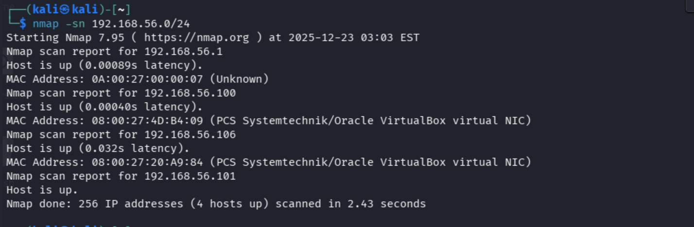
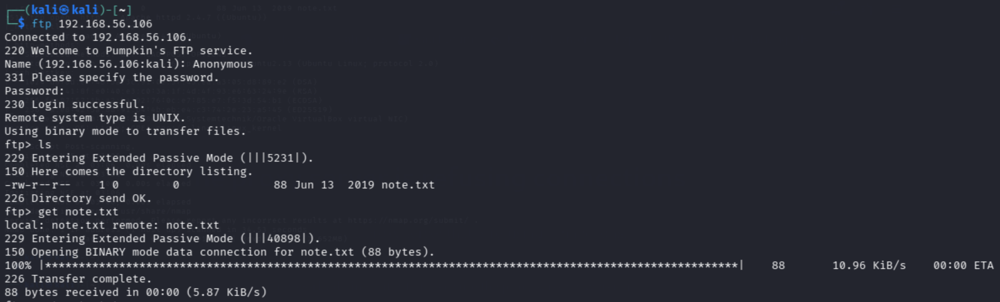

# 🎃 PumpkinGarden-CTF-Writeup
Complete walkthrough and proof-of-concept for the PumpkinGarden CTF. This project demonstrates network scanning, web enumeration, and Linux privilege escalation using a documented Sudo exploit to gain root access and retrieve the final key.

---

## 🔍 Phase 1: Scanning & Enumeration
[cite_start]I identified the target system at IP `192.168.56.106`[cite: 4].
* [cite_start]**Network Discovery**: Running `nmap -sn` confirmed the host was up[cite: 4, 5].

* [cite_start]**Service Scanning**: A deeper Nmap scan revealed FTP (Port 21), HTTP (Port 1515), and SSH (Port 3535)[cite: 8, 9].

* [cite_start]**Web Enumeration**: Exploring the web server revealed an `/img/` directory and a hidden secret path containing `clue.txt`[cite: 17, 21, 24].

---

## 🔓 Phase 2: Gaining Access
* [cite_start]**Decoding Credentials**: The `clue.txt` file held Base64-encoded credentials which were decoded for SSH access[cite: 20].

* [cite_start]**Initial Shell**: I successfully logged in via SSH as the user `goblin`[cite: 34].

---

## ⚡ Phase 3: Privilege Escalation
[cite_start]Once inside, I identified an outdated Sudo version vulnerable to the Tod Miller local root exploit[cite: 28, 35].

* [cite_start]**Execution**: After synchronizing the script with the system's cleanup intervals, I successfully gained a root shell[cite: 31, 37].

* [cite_start]**The Flag**: With root privileges, I accessed the `/root` directory and retrieved the final key[cite: 38].

---

## 📚 Technical Glossary
* **Nmap**: A tool used to "knock on the doors" of a computer to see which services are open.
* [cite_start]**FTP**: A protocol that allowed "Anonymous" login in this challenge, providing an initial entry point[cite: 13, 15].
* [cite_start]**Base64**: An encoding format used to hide credentials in `clue.txt`[cite: 20].
* [cite_start]**Root (LordPumpkin)**: The administrative user with total control over the machine[cite: 26, 32].
* [cite_start]**Privilege Escalation**: The process of moving from a low-privileged user (goblin) to root[cite: 25, 31].
